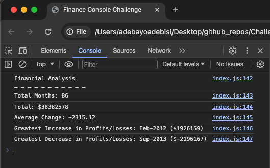
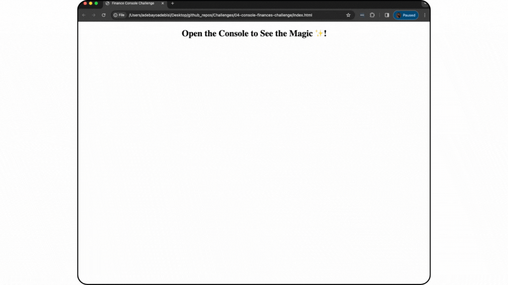

# 04 - Console Finances Challenge

# Financial Report

## Description
This activity is a real-world application of JavaScript to create codes for analysing the financial records of a company.

## Summary
Provided Finance Dataset - Arrays with two fields, Date and Profit/Losses.
Required task - Write JavaScript code that analyses the dataset to calculate the following:
- The total number of months included in the dataset.
- The net total amount of Profit/Losses over the entire period.
- The average of the changes in Profit/Losses over the entire period.
- The greatest increase in Profit/Losses (date and difference in the amounts) over the entire period.
- The greatest decrease in Profit/Losses (date and difference in the amounts) over the entire period.
Data logged in console.

## JavaScript Console
The following images shows the JavaScript Console displaying the required financial records.

> **Note** This is a screenshot of the JavaScript Console showing all the required records.

> **Note** This is a video of the JavaScript Console showing all the required records.

## References
[MDN Web Docs - Math.max()](https://developer.mozilla.org/en-US/docs/Web/JavaScript/Reference/Global_Objects/Math/max)

[MDN Web Docs - Math.min()](https://developer.mozilla.org/en-US/docs/Web/JavaScript/Reference/Global_Objects/Math/min)

[JavaScript For Loop](https://www.w3schools.com/js/js_loop_for.asp)

## License
Licensed under the MIT License

## GitHub Repository
URL: https://github.com/adebayoadebisi/04-console-finances-challenge  

## Deployed Web Application
URL: https://adebayoadebisi.github.io/04-console-finances-challenge/
